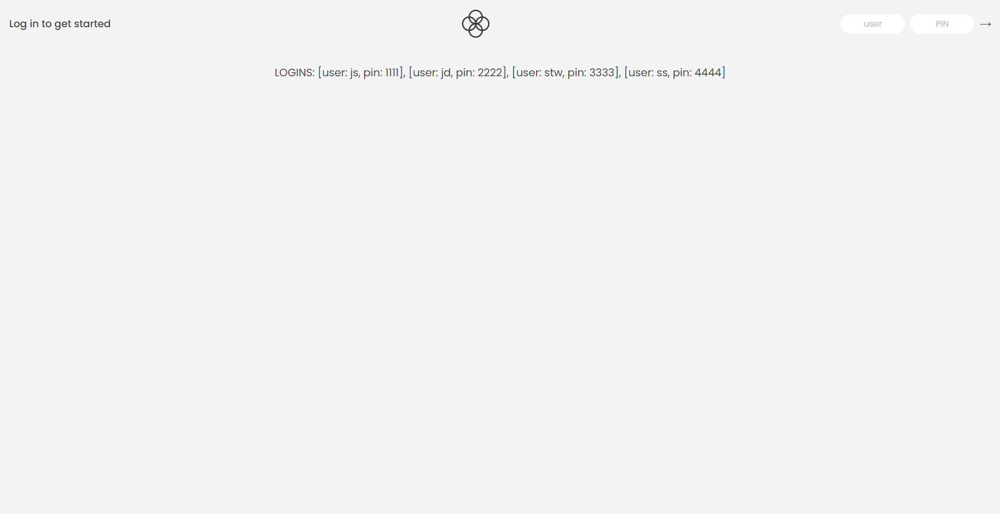

# Bankist App (Practice Project)

This is a practice project from a Udemy course by Jonas Schmedtmann. The purpose of this project is to practice using JavaScript to manipulate the DOM and to practice using new Array methods from ES6 and up.

## Description

This project is a simple banking app that allows users to log in, view their account balance, transfer money to other users, request a loan, and close their account. The app is built using HTML, CSS, and JavaScript. 

## Getting Started

Login information user can use to test the app are as follows:
[user: js, pin: 1111], [user: jd, pin: 2222], [user: stw, pin: 3333], [user: ss, pin: 4444]

### Dependencies

* This app requires a modern web browser to run.

### Installing

* No installation required.
* User can simply open the index.html file in a web browser to run the app.
* User can also go to the following link to view the app: https://jyoungjoon.github.io/bankist-app/

## Help

* For any issues, please contact the author at https://github.com/jyoungjoon
## Authors

* Jonas Schmedtmann [Twitter](https://twitter.com/jonasschmedtman?lang=en)
* Young Jang [Github](https://github.com/jyoungjoon)
## Version History

* 0.1
    * Initial Release

## License

This project is licensed under the MIT License - see the LICENSE.md file for details

## Acknowledgments

Inspiration, code snippets, starter-code provider, etc.
* Jonas Schmedtmann [Twitter](https://twitter.com/jonasschmedtman?lang=en)
* [awesome-readme](https://github.com/matiassingers/awesome-readme)
* [PurpleBooth](https://gist.github.com/PurpleBooth/109311bb0361f32d87a2)
* [dbader](https://github.com/dbader/readme-template)
* [zenorocha](https://gist.github.com/zenorocha/4526327)
* [fvcproductions](https://gist.github.com/fvcproductions/1bfc2d4aecb01a834b46)
